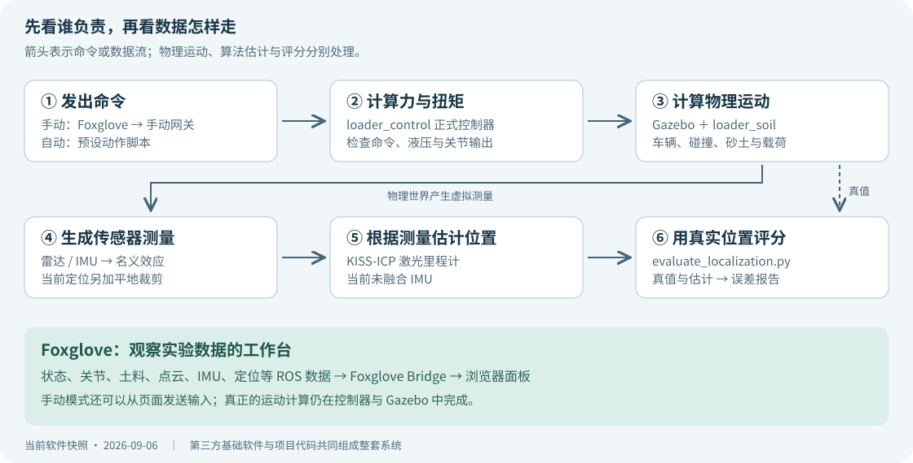

# 无人装载机仿真软件：零基础说明书

适用对象：想知道这套软件在做什么、怎样使用、每块代码负责什么，但还不会读 ROS 或 C++ 的项目使用者。

文档版本：2026-09-06。内容以当前项目代码和已保存的测试结果为依据。后续开发状态请看 [开发状态](deployment_status.md)。

装载机模型正在单独更新。本版着重解释软件职责和阅读入口；模型尺寸、安装位置等具体数值请以最新模型文件为准。

**你现在不需要从第一行代码开始学。先认识软件的几个部分，再顺着一个动作看它们怎样配合。**

## 1. 先弄清楚：这到底是一套什么软件

这是一套在电脑里做装载机实验的软件。电脑中有一辆简化装载机、一片地面和一堆砂土。你或程序发出驾驶、举升、翻斗命令，软件计算车怎么动、铲斗受到多少阻力、装进多少材料，再把过程和数据展示出来。

它主要帮助我们回答三类问题：车能否按命令动作；传感器能否看到周围环境；定位算法能否判断车走到了哪里。

| 你看到的东西 | 背后实际发生的事情 |
| --- | --- |
| 车轮转动、车往前走 | 控制程序施加扭矩，Gazebo 计算运动和碰撞 |
| 铲斗举起、土堆出现缺口 | 控制程序计算工作装置受力，土料程序扣除被铲走的体积 |
| Foxglove 中出现车速曲线 | 状态数据经过消息通道送到浏览器 |
| 一大片彩色的点 | 虚拟雷达测到了周围表面，点的颜色用于帮助观察 |
| 定位页面显示位置 | KISS-ICP 根据前后扫描的变化估计车辆移动 |
| 自动演示完成一套动作 | 脚本按预设流程发命令，部分动作使用关节反馈 |

**当前自动演示是预先编写的作业流程。自主找料堆、规划路线、决定怎么铲装，还没有全部实现。** 开发时使用 AI 写代码，也不表示仿真车里已经运行了大语言模型或完整自动驾驶系统。

### 第一次阅读怎么安排

先读第 2、3 节，建立整体认识；想实际操作时读第 4 节；想知道代码在干什么时读第 5～7 节。遇到文件名不认识，就打开配套 [代码地图](code_map.md)。第 8～11 节用于查参数、结果和故障，不用一次背完。

## 2. 六个部分分别在做什么

可以把这套软件看成一场分工明确的实验：有人发命令，有人算运动，有人模拟测量，还有人记录成绩。



| 部分 | 用日常语言解释 | 你最容易找到的入口 |
| --- | --- | --- |
| 启动器 | 按顺序把实验需要的程序叫起来，结束时关闭它们 | `scripts/windows/run_loader_soil_demo.ps1` |
| 车辆模型与控制器 | 模型规定车的形状和连接；控制器把命令变成关节上的力或扭矩 | `loader_description`、`loader_control` |
| Gazebo 与土料模型 | Gazebo 计算物理运动；土料插件计算铲土阻力、材料转移和料堆变化 | Gazebo、`loader_soil` |
| 传感器与效应处理 | 模拟雷达、IMU 的测量，再给雷达加入部分丢点和扫描畸变 | `loader.urdf.xacro`、`loader_sensor_effects` |
| 定位与评测 | 定位程序估计位置；另一个程序用仿真中的真实位置来评分 | KISS-ICP、`evaluate_localization.py` |
| Foxglove | 把数据画成曲线、仪表和点云；手动模式下也能发送操作输入 | `foxglove/loader_simulation_layout.json` |

ROS 2 负责让这些程序通过规定好的消息交流。例如，控制器发布“当前车速”，Foxglove 接收并画图，其他程序也可以接收同一条信息。

### 两个画面为什么同时存在

**Gazebo 窗口主要看物理现场**：车在哪里、铲斗有没有碰到地面、砂堆怎么变了。

**Foxglove 页面主要看数据**：车速是多少、液压压力怎么变、雷达测到了什么、定位估计是否在移动。它展示的是程序收到的数据；例如选择 `odom` 坐标系时，车辆的位置会受到定位估计影响，不能直接当作真实位置。

Foxglove 布局文件只规定面板怎么摆、显示哪个数据。修改曲线颜色不会改变装载机物理参数。

## 3. 文件在哪里，程序又在哪里运行

本项目使用 Windows 和 Windows 内的 Ubuntu 两个环境。

| 位置 | 放什么 | 通常怎样接触它 |
| --- | --- | --- |
| Windows 项目目录 | 我们写的源代码、场景、配置、文档 | 在文件资源管理器或编辑器中打开 |
| Ubuntu / WSL | ROS 2、Gazebo、控制程序和定位算法的运行环境 | Windows 启动器会替你进入 |
| WSL 运行目录 | 编译产物、已安装的程序、日志和实验结果 | 排查问题或查看报告时打开 |

Windows 源码目录是：

```text
C:\Users\Liyangchuan\Documents\ChatGPT\New project
```

Ubuntu 访问同一份源码时，路径写成：

```text
/mnt/c/Users/Liyangchuan/Documents/ChatGPT/New project
```

**这两个路径指向同一份项目文件，不是两套需要手动同步的代码。** 路径里的空格是名称的一部分，复制命令时保留引号。

程序编译和实验结果主要放在：

```text
/home/lyc/loader_sim_runtime
```

你也可以在 Windows 文件资源管理器的地址栏粘贴下面这一行：

```text
\\wsl.localhost\Ubuntu-24.04\home\lyc\loader_sim_runtime
```

### build、install、log、results 有什么区别

| 目录 | 直观含义 | 是否应该在里面改源代码 |
| --- | --- | --- |
| `build/` | 编译过程的中间文件，相当于加工现场 | 不在这里改 |
| `install/` | 构建后供程序启动使用的文件 | 回项目源码目录改，再构建 |
| `log/` | 启动、运行、出错的过程记录 | 主要用于阅读 |
| `results/` | 测试报告、数据表、生成的模型等实验产物 | 用于分析与保存证据 |
| `localization/` | 单独构建的第三方 KISS-ICP 源码和程序 | 日常先改项目里的定位配置 |

**构建**就是把源代码加工成可运行的程序。**启动**是让已经构建好的程序开始工作。安装环境、构建代码、启动演示是三件不同的事；日常看演示通常只需要启动。

## 4. 第一次怎么用：只选一种模式启动

以下操作针对当前已经部署好的这台电脑。第一次先看基础演示，熟悉后再看传感器和定位。每次结束前一个演示，再启动下一个。

### 4.1 打开基础演示

打开普通 Windows PowerShell，先输入：

```powershell
cd "C:\Users\Liyangchuan\Documents\ChatGPT\New project"
```

再输入：

```powershell
powershell -ExecutionPolicy Bypass -File .\scripts\windows\run_loader_soil_demo.ps1
```

启动成功后，会出现 Gazebo 窗口和 Foxglove 浏览器页面。终端会记录启动过程。车辆自动执行铲取、举升、倒车转运、制动和卸料，你先观察即可。动作结束后，Gazebo 会继续开着。

如果镜头没有对准车，在 Gazebo 的 `Entity tree`（物体列表）中选中 `soil_loader`，按 `F` 聚焦。刚启动时需要等待场景和控制器就绪。

**结束方法：**关闭 Gazebo 窗口，或者回启动它的 PowerShell 按 `Ctrl+C`。只关闭 Foxglove 浏览器页面，不会停止仿真。

### 4.2 想自己操作车

先结束自动演示，再运行完整命令：

```powershell
powershell -ExecutionPolicy Bypass -File .\scripts\windows\run_loader_soil_demo.ps1 -Mode physics -ControlMode manual
```

在 Foxglove 的“手动控制”页，先举升、收斗，让铲刃离开地面，再尝试行驶。方向键按住时持续操作，松开后网关会在约 0.35 秒内回中制动。工作装置和行驶使用各自的操作面板，详细按钮映射见 [使用简介](user_guide.md)。

急停会保持生效，恢复时使用“释放急停”和“启用手动控制”。这些控制只用于当前仿真实验。

### 4.3 想看雷达和 IMU

```powershell
powershell -ExecutionPolicy Bypass -File .\scripts\windows\run_loader_soil_demo.ps1 -Mode perception
```

这会运行带传感器的自动铲装演示。“感知与三维”页看原始雷达和 IMU；“第四阶段·传感器”页看加入丢点、扫描畸变后的点云。

基础 `physics` 模式中没有这些感知话题，所以对应面板为空是正常现象。

### 4.4 想看定位算法和误差报告

本机已完成 KISS-ICP 构建，可以直接运行：

```powershell
powershell -ExecutionPolicy Bypass -File .\scripts\windows\run_loader_soil_demo.ps1 -Mode perception -Localization kiss_icp -Scenario localization
```

程序会在有固定标志物的场景中，执行举升收斗、倒车、制动、前进和停车，并记录定位结果与真值。动作结束后生成误差报告。它是专门的行驶试验，与默认铲装演示的动作不同。

如果以后换了环境，启动时明确提示需要构建定位程序，才执行以下命令：

```powershell
wsl -d Ubuntu-24.04 -u lyc -- bash '/mnt/c/Users/Liyangchuan/Documents/ChatGPT/New project/scripts/wsl/bootstrap_localization.sh'
```

### 4.5 命令里的几个选项是什么意思

| 选项 | 可以填什么 | 改变什么 |
| --- | --- | --- |
| `-Mode` | `physics` 或 `perception` | 是否启用当前感知链路；两种都计算物理运动 |
| `-ControlMode` | `auto` 或 `manual` | 命令由演示脚本发，还是由你在页面上操作 |
| `-Localization` | `none` 或 `kiss_icp` | 是否运行当前激光里程计 |
| `-Scenario` | `soil` 或 `localization` | 选择默认铲装流程，还是专用定位行驶流程 |

不写选项时，默认是 `physics + auto + none + soil`。定位需要 `perception`；专用定位行驶流程还要求 `auto + kiss_icp`。先使用上面给出的完整组合，不必自己拼选项。

### 4.6 Foxglove 第一次需要做什么

浏览器可能先显示登录页。登录后连接 **Foxglove WebSocket** 数据源，地址为 `ws://localhost:8765`。`localhost` 表示当前电脑，`8765` 是这条连接使用的端口编号。

在布局菜单寻找 `Layouts → Import from file...`，选择：

```text
C:\Users\Liyangchuan\Documents\ChatGPT\New project\foxglove\loader_simulation_layout.json
```

界面菜单名称可能随 Foxglove 版本变化；核心操作是“从文件导入布局”。项目更新布局后，需要重新导入文件。

| 标签页 | 第一次重点看什么 |
| --- | --- |
| 整车总览 | 车速、压力和斗内载荷有没有随动作变化 |
| ROS 节点与消息 | 各程序交换的数据长什么样，暂时不必理解所有字段 |
| 手动控制 | 驾驶、举升、翻斗和急停按钮 |
| 感知与三维 | 雷达有没有看到地面、车体和周围物体 |
| 第四阶段·传感器 | 加入效应后的传感器输入 |
| 第四阶段·定位 | 算法估计的位置有没有随行驶变化 |

截至本文版本，真实数据和控制回路自动检查已通过；此前浏览器停在登录页，登录后的六页布局目视验收仍待完成。

## 5. 跟着一次“举升”看懂代码如何合作

这里以手动举升为例。你不用理解每个函数，只需要知道信息经过了哪些站。

1. **你按下 Foxglove 的工作装置按钮。** 浏览器发送操作输入，Foxglove Bridge 把它交给 ROS 2。
2. **`loader_manual_gateway.py` 翻译输入。** 它把行驶和工作装置输入整理成统一的 `VehicleCommand`，发送到 `/loader/command`。它还处理输入超时、使能和急停。
3. **`loader_command_controller.cpp` 计算执行器输出。** 它检查命令，计算名义油压和机构受力，向正式控制接口写入力或扭矩。
4. **Gazebo 计算下一步运动。** 车体质量、关节连接、重力、碰撞和外力共同决定动臂到底举了多少。
5. **相关程序发布状态。** 控制器发 `/loader/state`；`joint_state_broadcaster` 发 `/joint_states`；`robot_state_publisher` 根据关节角计算各部件间的坐标变换。
6. **Foxglove 更新显示。** 你看到举升角、压力曲线和车体模型发生变化。Gazebo 窗口也显示物理世界中的新姿态。

自动模式只更换第 1、2 步的命令来源：由演示脚本直接发布统一命令，后面的正式控制链仍然使用。

### 三个容易看错的地方

`lift_valve_command = 0.25` 表示归一化的阀控制请求，不表示铲斗升高 0.25 米。实际运动还取决于重力、负载、机构位置等。

`VehicleCommand` 表示“希望怎么做”，`VehicleState` 表示“当前反馈是什么”。命令发出后，反馈不一定马上达到目标。

当前整车状态里的纵向速度由轮速换算；定位评分使用另一条独立的 Gazebo 位姿真值，不能用轮速推算值替代真实运动轨迹。

模型文件描述车的结构；当前正常动作通过力或扭矩驱动。读取关节状态来画模型，与直接把物理车辆瞬移到目标位置，是两种不同操作。

## 6. 六个 ROS 包：核心代码分别负责什么

ROS 包可以理解为按功能整理的一组文件，集中放在 `ros_ws/src/`。每个包里面经常能看到 `package.xml` 和 `CMakeLists.txt`：前者声明名称和依赖，后者说明怎样构建、安装。这两个文件主要用于装配软件。

### 6.1 loader_sim_msgs：规定数据怎么写

它定义程序之间交换的“四种表格”，本身不让车运动。

| 文件 | 表格里装什么 |
| --- | --- |
| `VehicleCommand.msg` | 挡位、牵引扭矩、制动、转向目标、举升/翻斗阀命令、急停 |
| `VehicleState.msg` | 车速、轮速、关节状态、油缸位置和压力、斗内载荷、故障状态 |
| `BucketInteraction.msg` | 铲斗受力、侵入深度、材料流入流出、斗内材料体积和质量 |
| `TerrainState.msg` | 砂土高度、剩余体积、挖走/卸回体积、守恒误差 |

例如，“车速”字段叫 `longitudinal_speed_mps`，末尾的 `mps` 说明单位是米/秒。其他程序按照同一个字段名读取它，就能正确交流。

### 6.2 loader_description：规定车长什么样、各部件怎样连接

核心文件是 `ros_ws/src/loader_description/urdf/loader.urdf.xacro`。里面描述车架、车轮、动臂、铲斗、质量、惯量、关节限制，以及雷达和 IMU 的安装位置。Xacro 可以看作带参数开关的车辆模型模板。

启动时，它被展开为 Gazebo 可以使用的车辆描述。`enable_ros2_control` 等参数决定启用哪些插件；`enable_lidar_imu` 决定是否加入传感器；`enable_ground_truth` 决定是否输出评测真值。

`config/nominal_linkage.yaml` 与 `tools/kinematics/generate_linkage_table.py` 用于检查举升、翻斗的几何关系。当前控制器中仍有直接写在 C++ 里的名义几何公式，不能认为改了这份 YAML 就自动改好了整个动力学模型。

`launch/display.launch.py` 是另一个入口，用 RViz 和关节滑块检查模型显示。它不是当前整车力级铲装演示的启动器。

### 6.3 loader_control：当前正式执行命令的地方

核心文件是 `ros_ws/src/loader_control/src/loader_command_controller.cpp`。

它接收 `/loader/command`，读取各关节的位置与速度，计算轮端扭矩、制动、铰接转向、举升与翻斗输出，同时处理命令限幅、超时和急停。它还接收土料模块的斗内质量，写进整车状态供其他程序读取。

它运行在 ROS 2 的 `controller_manager` 中；后者负责装载、启动控制器，并组织控制接口。控制器输出经 Gazebo 的 `GazeboSimSystem` 接口作用到仿真关节。

四个车轮、铰接、举升、翻斗共有 7 路主动输出；加上后桥摆动，当前读取 8 个关节状态。`config/loader_controllers.yaml` 规定控制器类型和 500 Hz 更新频率等。

以后读 C++ 时，可以先找 `on_configure`（准备订阅和发布）、`on_activate`（开始工作）、`update`（每次控制更新），不用从数学辅助函数逐行读起。

### 6.4 loader_soil：铲土、卸土和砂堆变化

核心文件是 `ros_ws/src/loader_soil/src/loader_soil_slice_system.cpp`，作为插件加载进 Gazebo。

它跟踪斗刃位置，计算侵入、扫过的材料体积、名义切削阻力和入斗量。卸料时把体积重新放回地形；装进斗里的材料还会产生向下的重量，并在状态中报告质量。

当前整车使用“二维剖面加固定宽度”的砂土模型：先保存沿一个方向的高度，再外挤成有宽度的料堆。画面中的一排料柱用于显示和雷达测量。它能看起来是三维的，但内部还不是完整三维散料模型。

当前载荷处理包含额外重力和名义质心反馈，完整的载荷惯量更新仍待开发。砂土阻力由插件负责；刚性地面仍保留 Gazebo 碰撞，避免把砂土阻力重复算两遍。

### 6.5 loader_sensor_effects：让雷达输入带上名义误差

核心代码有两个文件：`effects.py` 保存丢点和旋转计算，`lidar_effects_node.py` 负责接收、处理和发布点云。

输入是原始雷达点云，输出是 `/loader/sensors/lidar/scan/points_effect`。当前配置对点进行约 10% 的随机丢失，并根据 IMU 角速度加入旋转扫描畸变。丢掉的点用 `NaN` 表示“这一点没有有效测量”，不是坐标变成零。

配置放在 `ros_ws/src/loader_sensor_effects/config/nominal.yaml`。原始点云仍保留用于对照，但原始雷达本身也已配置距离噪声，不能把它理解为完全无误差的数据。

IMU 的基础噪声配置在车辆 Xacro 的 Gazebo 传感器定义里。本包当前没有融合 IMU 来计算车辆位置，也没有实现平移扫描畸变。

### 6.6 loader_dynamics：保留的早期动力学原型

核心文件是 `ros_ws/src/loader_dynamics/src/loader_dynamics_system.cpp`。它以前直接从 ROS 命令驱动 Gazebo 关节，现在保留作独立测试和对照，日常演示默认关闭。

**现在看正式车辆控制行为，应先找 `loader_control`。** 两份代码中有相似公式，是开发迁移留下的结果。不要同时启用 `enable_dynamics` 和 `enable_ros2_control`，否则两套执行器会争用关节。

## 7. 定位为什么又多了好几个程序

定位要分开处理“测量”“估计”和“评分”，否则容易出现拿真实答案假装算法结果的情况。当前流程如下：

```text
Gazebo 雷达
  → 原始点云 /loader/sensors/lidar/scan/points
  → 效应处理：丢点、旋转畸变
  → /loader/sensors/lidar/scan/points_effect
  → 平地裁剪 filter_localization_cloud.py
  → /loader/localization/points
  → KISS-ICP
  → 估计位置 /loader/localization/odometry
  → 评测器 evaluate_localization.py

Gazebo 独立真实位置 /loader/ground_truth/odometry
  → 同一个评测器，用于比较与评分
```

KISS-ICP 使用前后点云的重合关系估计运动。这个算法来自第三方项目，其源码放在 WSL 运行目录的 `localization/src/kiss-icp/`。项目内保存固定版本的构建脚本、参数和接入代码。

| 文件 | 为什么需要它 |
| --- | --- |
| `bootstrap_localization.sh` | 下载固定版本并构建 KISS-ICP，便于复现 |
| `simulation/config/localization/kiss_icp.yaml` | 指定量程、裁剪高度、算法参数和线程数 |
| `generate_localization_world.py` | 在现有感知世界周围加入 8 个固定标志物 |
| `run_localization_scenario.py` | 用控制命令完成可重复的举升、倒车、前进行驶流程 |
| `filter_localization_cloud.py` | 从效应点云中排除近场、远场、无效点和当前平地回波 |
| `evaluate_localization.py` | 按时间匹配算法估计和真实位置，输出误差报告 |
| `test_localization_metrics.py` | 用可手算的轨迹检查评分代码，防止错误对齐掩盖漂移 |

### 为什么要裁掉部分地面点

第一轮扫描中，大面积平地的重复采样让配准几乎以为车辆没动。对当前平地试验做高度裁剪后，结果有明显改善。这个阈值根据当前雷达安装高度设置，不适合直接搬到坡地或剧烈颠簸场景；后续需要更完整的地面分割和车体滤除。

### 真值、坐标系和误差怎么理解

**真值**是仿真器知道的真实运动状态，相当于评分时的参考答案；KISS-ICP 不读取这条答案通道。

**坐标系**是“从哪里开始量、朝哪个方向量”的约定。`world` 是仿真世界的参考，`base_link` 是车体参考，`lidar_link` 是雷达参考，`odom` 是里程计使用的参考。TF 是它们之间的位置和朝向换算关系。

评测器先用第一对位姿把两个参考系对齐，后续就比较偏差，不用整条轨迹重新拟合。**RMSE** 可以理解为把整段试验的误差合成一个数，大误差受到更大权重；它不是最大误差，也不表示每一帧都偏同样的距离。

**2026-09-06 当前单次基线：**真实行程约 16.7 米，185 对位姿，位置 RMSE 约 0.54 米，最大位置误差约 1.19 米；位置 RMSE 目标为 0.15 米，尚未通过。详细指标见 [定位说明](localization.md)。这条基线暂未融合 IMU，也没有闭环建图或已有地图重定位。

## 8. 想改某个效果，应该找哪里

先说清楚你想改变的是“画面”“物理行为”“测量误差”还是“算法”，通常就能缩小到一个目录。

| 想改什么 | 先找哪里 | 修改后通常要做什么 |
| --- | --- | --- |
| 曲线颜色、显示哪个变量、面板位置 | `foxglove/loader_simulation_layout.json` | 重新导入布局 |
| Gazebo 镜头与 GUI 初始设置 | `simulation/config/gui/loader_demo.config` | 重新启动演示 |
| 自动动作的顺序或持续时间 | `tools/ros/test_loader_soil_coupling.py`；定位行驶用 `run_localization_scenario.py` | 重启对应试验并检查动作 |
| 手动按钮对应的牵引、转向上限和超时 | `tools/ros/loader_manual_gateway.py` | 重启手动演示并验证按钮和制动 |
| 车身尺寸、质量、关节、雷达安装位置 | `loader_description/urdf/loader.urdf.xacro` | 重新生成模型；同步核对控制器名义几何 |
| 控制器中的名义液压或力学公式 | `loader_control/src/loader_command_controller.cpp` | 构建，再做控制回归 |
| 整车铲土受力和材料转移 | `loader_soil/src/loader_soil_slice_system.cpp` 及 Xacro 中的插件参数 | 构建、检查铲装和守恒 |
| 雷达分辨率、频率、距离噪声；IMU 噪声 | 车辆 Xacro 中的传感器定义 | 重启，再检查传感器数据 |
| 雷达额外丢点和旋转畸变 | `loader_sensor_effects/config/nominal.yaml` | 重启 perception，运行效应检查 |
| 当前定位参数和平地裁剪 | `simulation/config/localization/kiss_icp.yaml` | 重跑定位评测，与旧报告对比 |
| 新的车辆命令或状态字段 | `loader_sim_msgs/msg/`，以及所有读写它的代码 | 构建，并同步改发布、接收和布局 |

表中省略 `ros_ws/src/` 的包路径，都位于该目录下；完整可点击路径见 [代码地图](code_map.md)。

### 为什么改了 YAML 有时不生效

配置文件只有被程序实际读取才会生效。目前 `profiles/` 中有整体运行方案，`materials/` 中有原型材料参数，但正式启动器并不会自动把所有 YAML 合成一份全局配置。某些数值还写在 C++ 或 Xacro 里。

例如，三维砂土 YAML 供独立 Python 原型使用；改它不会自动把 Gazebo 中的二维土料模型改成三维。确认配置生效，需要找到启动脚本中的参数加载位置，再看实际输出是否改变。

### 需要构建时用这一条

先停止当前演示，在 PowerShell 执行：

```powershell
wsl -d Ubuntu-24.04 -u lyc -- bash '/mnt/c/Users/Liyangchuan/Documents/ChatGPT/New project/scripts/wsl/build_workspace.sh'
```

C++ 源码和消息定义修改后需要构建。Python、配置和模型有些通过链接安装，有些通过安装步骤复制；拿不准时也运行这条构建命令，再启动新进程。只改本说明书无需构建仿真。

## 9. 测试文件在干什么，怎样看结果

很多文件以 `test_`、`smoke_test_` 开头，所以容易让人以为有很多套独立软件。它们多数是验收人员：搭好一个场景，执行检查，然后给出结果。

| 名称习惯 | 通常负责什么 |
| --- | --- |
| `bootstrap_*`、`install_*` | 安装依赖、取得第三方源码、构建或安装基础软件 |
| `build_*` | 构建我们自己的代码 |
| `run_*` | 启动或执行一段流程；具体是否是测试要看文件用途 |
| `smoke_test_*` | 跑一轮最小实际场景，检查基础功能有没有接通 |
| `test_*` | 对收到的数据或计算结果作判断，有的也会发仿真命令 |
| `verify_*`、`validate_*` | 核查环境、安装或模型是否满足预期 |
| `benchmark_*` | 测速度、频率、实时系数和资源占用 |

特别注意：`test_loader_soil_coupling.py` 同时被默认自动演示用来发动作命令，因此这个带 `test` 的文件也会影响你看到的演示流程。

### 三种验收，不要混为一谈

**构建成功**表示代码可以被加工成程序。**链路通过**表示命令、数据和计算流程能运行。**精度通过**表示计算结果达到规定的误差门槛。它们检查的是不同事情。

终端中的 `PASS` 对应一项检查通过，`FAIL` 对应失败。定位冒烟还会打印 `OPEN`，表示链路已跑通，但名义精度目标仍未通过；报告中的 `nominal_accuracy_pass: false` 也表达同一件事。

### 当前常用的三个检查入口

下面命令都会启动测试。只在需要验证时选择一条，并先结束正在运行的演示，不需要每次使用软件都运行全部检查。

检查带传感器的 Foxglove 数据和控制回路：

```powershell
wsl -d Ubuntu-24.04 -u lyc -- bash '/mnt/c/Users/Liyangchuan/Documents/ChatGPT/New project/scripts/wsl/smoke_test_foxglove_bridge.sh' perception
```

检查雷达效应和 IMU 噪声：

```powershell
wsl -d Ubuntu-24.04 -u lyc -- bash '/mnt/c/Users/Liyangchuan/Documents/ChatGPT/New project/scripts/wsl/smoke_test_sensor_effects.sh'
```

执行无界面的定位行驶评测：

```powershell
wsl -d Ubuntu-24.04 -u lyc -- bash '/mnt/c/Users/Liyangchuan/Documents/ChatGPT/New project/scripts/wsl/smoke_test_localization.sh'
```

### 日志和报告去哪里找

| 要看什么 | WSL 运行目录中的位置 |
| --- | --- |
| 基础演示中 Gazebo 为什么没起来 | `log/loader_soil_demo_gazebo.log` |
| 基础演示中 Foxglove 桥为什么没连接 | `log/loader_soil_demo_foxglove.log` |
| 手动网关运行记录 | `log/loader_soil_demo_manual_gateway.log` |
| perception 演示日志 | 上述 `loader_soil_demo` 后加 `_perception`，例如 `loader_soil_demo_perception_gazebo.log` |
| KISS-ICP 与裁剪程序日志 | `log/loader_localization.log`、`log/loader_localization_crop.log` |
| 定位统计指标 | `results/localization/metrics.json` |
| 定位逐帧误差表 | `results/localization/trajectory.csv` |
| 原始估计与真值记录 | `results/localization/poses.json` |
| Foxglove 感知验收报告 | `results/foxglove_bridge_perception_smoke.txt` |
| 传感器效应验收报告 | `results/sensor_effects_smoke.txt` |

这些路径的前面都是 `/home/lyc/loader_sim_runtime/`。运行目录中同名结果可能被下一次测试覆盖，重要试验应另存一份。项目已保存 [2026-09-06 的基线快照](baselines/2026-09-06/README.md)。

## 10. 当前做到哪了，哪些还不能当作完成

本文的阶段编号沿用项目路线图；M1、M2 是第四阶段内部的小里程碑。开发存在交叉推进，进入第四阶段不表示前三阶段的所有精细化工作都结束了。

| 范围 | 当前实际状态 | 还缺什么 |
| --- | --- | --- |
| 第一阶段：基础环境 | ROS、Gazebo、GPU 和通信基础已跑通 | 持续关注本机运行稳定性 |
| 第二阶段：装载机 | 简化模型、正式力级控制、基本保护已跑通 | 厂家几何与实车参数标定，轮胎和液压细化 |
| 第三阶段：砂土 | 二维土料已接入整车；独立三维高度场原型已验证 | 三维内核迁入整车、溢料、载荷惯量和材料标定 |
| Foxglove 可视化 | 六页布局已准备；14 个感知模式实时通道和控制回路通过 | 登录后对六页布局做目视确认 |
| 第四阶段 M1：传感器效应 | 原始/效应点云逐帧对应，实测均为 10 Hz；IMU 噪声检查通过 | 平移畸变、更多误差来源、目标传感器标定 |
| 第四阶段 M2：定位 | KISS-ICP、独立真值和自动误差报告已接通 | 0.15 m 精度门槛、IMU 融合、多工况重复评测 |
| 后续自主作业 | 已有路线和部分配置骨架 | 完整规划控制、地图重定位、鱼眼/BEV 等继续开发 |

**`nominal` 表示目前采用估算或简化参数。** `validated` 才表示经过所规定的对照和验收。文件里写了一个配置项或安装了某个库，不等于对应功能已经验收。

Chrono DEM 已完成小规模颗粒运行和链接验证。它是未来离线标定砂土模型的工具，当前 Gazebo 演示中的砂堆没有使用 Chrono 逐颗粒计算。

`tools/soil_heightfield_3d/` 中的三维原型也是单独运行的；它没有因为文件存在，就自动替换整车里的二维插件。`bev_capture.yaml` 描述的是目标数据采集配置，不表示四路鱼眼和 BEV 已经接好。

## 11. 看不懂或出问题时，先从现象判断

| 现象 | 先判断什么 | 可以先做什么 |
| --- | --- | --- |
| Foxglove 是登录页面 | 还没有进入工作台 | 登录，连接本机数据源，导入布局 |
| 基础演示的点云面板为空 | 是否使用了 `physics` | 需要点云时改用完整的 perception 启动命令 |
| 定位页没有里程计 | 是否启用了 `kiss_icp` | 使用第 4.4 节的完整命令 |
| Gazebo 在动，Foxglove 没数据 | 桥连接、数据源、话题或布局有问题 | 检查终端错误和 Foxglove 桥日志 |
| 收到点云，但车和点云对不上 | 坐标系和 TF 换算可能有问题 | 记录面板固定坐标系和错误提示，查看 TF 链路 |
| 手动前进时车推不动 | 铲刃是否顶住地面，是否仍在急停或禁用状态 | 先举升收斗，再核对手动使能状态 |
| 提示 8765 已被占用 | 前一次仿真或桥可能还开着 | 回原启动窗口正常结束，再启动 |
| `Package not found` 或找不到插件 | 构建结果或运行环境未加载 | 从正式启动器启动；必要时重新构建 |
| `[WARN:COPY MODE]`、窗口不出现 | WSLg 图形显示异常 | 当前启动器会尝试修复；此修复会重启 WSL 并停止其进程 |
| 整台 Windows 蓝屏重启 | 需要主机故障证据，不能只看项目日志 | 保留时间、错误码和转储信息，参考已有主机故障记录 |

如果需要我继续排查，提供“用的哪条启动命令、在哪个窗口、做到哪一步、最后的错误文字”就足够开始。比如：“用 perception 启动，Gazebo 的车会动，但 Foxglove 的整车总览没有车速曲线。”

### 常见缩写，用到时再查

| 名称 | 在本项目里怎么理解 |
| --- | --- |
| WSL / WSLg | Windows 里的 Linux 环境 / 让 Linux 图形窗口显示出来的组件 |
| ROS 2 / Node | 程序通信和组织框架 / 其中一个有名称、可收发消息的工作单元 |
| Topic / Message | 数据通道名称 / 通道中一条数据的规定格式；Topic 名不是文件路径 |
| Plugin | 被宿主程序加载的一块扩展功能；例如 Gazebo 土料插件 |
| Bridge / WebSocket | 连接两种通信方式的程序 / 浏览器与本机桥使用的连接方式 |
| URDF / Xacro / SDF | 机器人描述 / 带参数的机器人描述模板 / Gazebo 场景与模型描述 |
| PointCloud2 / IMU | 三维点云消息 / 测量角速度和加速度等信息的惯性传感器 |
| TF / Odometry | 坐标系之间的换算 / 根据连续测量估计的运动与位置 |
| Hz / RTF | 每秒发生多少次 / 仿真时间与现实时间推进速度的比值 |
| `/clock` | 仿真自己的时钟，暂停或变慢时不一定与现实秒表相同 |
| m/s、rad、Pa、N·m | 米/秒、弧度、帕斯卡、牛顿米，分别常用于速度、角度、压力、扭矩 |
| DEM / BEV | 逐颗粒计算的离散元方法 / 从上往下看的鸟瞰表达 |
| NaN / RMSE | 没有有效数值 / 衡量一段结果总体误差的指标 |

单位小例子：1 m/s = 3.6 km/h；约 1.57 rad = 90°；1,000,000 Pa = 1 MPa。500 Hz 控制与 10 Hz 雷达表示它们按不同节奏工作，不要求所有消息数量一样。

## 12. 想继续深入，按问题选文档

| 你现在的问题 | 下一份文档 |
| --- | --- |
| 某个文件到底干什么 | [代码地图](code_map.md) |
| 日常如何启动、操作按钮 | [使用简介](user_guide.md) |
| 哪些功能已经验收 | [开发状态](deployment_status.md) |
| Foxglove 的面板、话题和验证 | [可观测工作台](observability.md) |
| 命令怎样变成关节受力 | [正式控制链](ros2_control.md) |
| 程序之间的数据字段 | [ROS 接口](ros_interfaces.md) |
| 砂土体积与受力怎么计算 | [二维土料](soil_slice.md)、[三维高度场](soil_heightfield_3d.md) |
| 雷达和 IMU 的误差 | [传感器链路](lidar_imu.md) |
| 定位如何接入、如何评分 | [定位基线](localization.md) |
| 整个项目将来准备做什么 | [总体路线图](../windows_loader_simulation_plan.md) |

路线图表达目标，本说明书解释当前软件，开发状态和测试报告说明已经得到的证据。阅读时先确认自己正在看哪一种文档。
