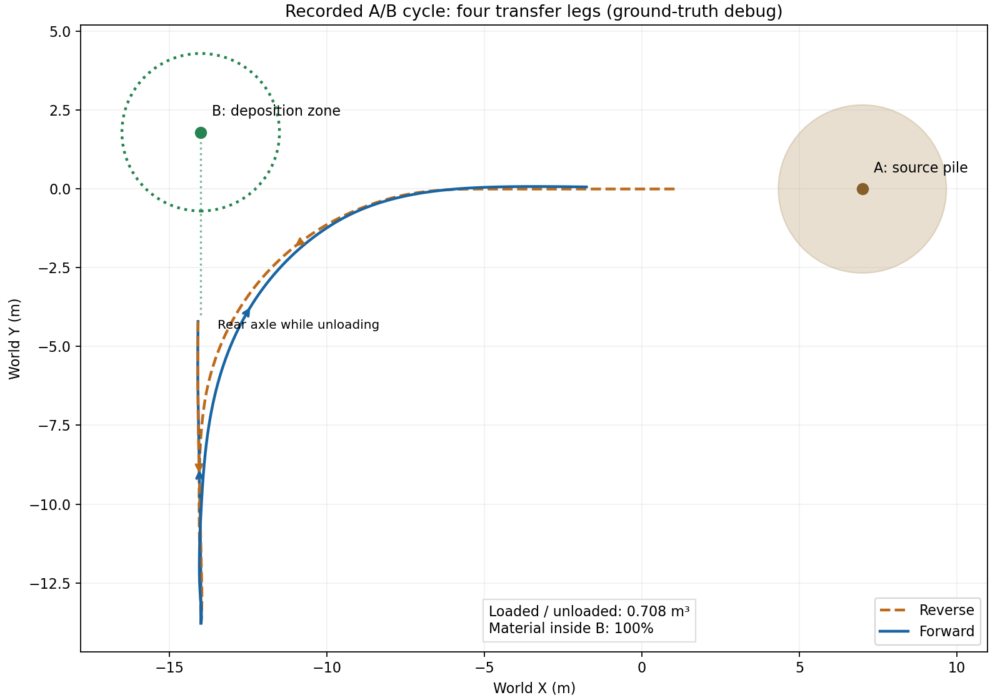
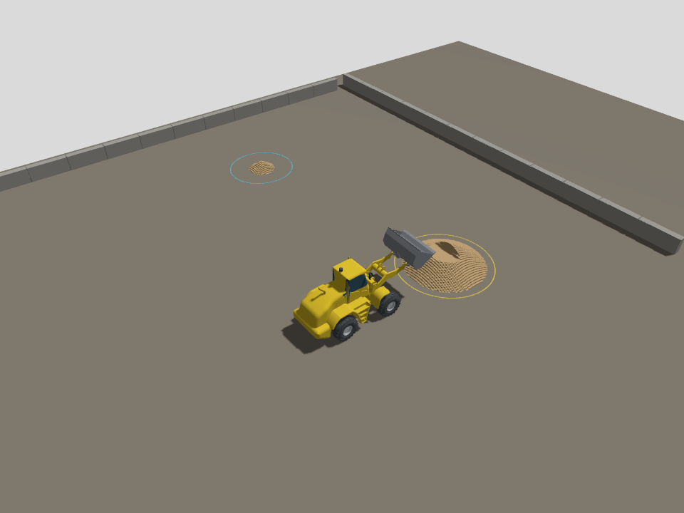

# 下一阶段：三维料堆、A→B 转向作业与第四阶段完整验收

更新日期：2026-09-08。本文件同时维护开发目标、已完成记录和待办，勾选项以对应测试证据为准。

当前状态：2026-09-08 按用户要求暂停，以节省其他项目的 token。三维斗刃、动态载荷已完成；常规绕障完整循环、估计定位闭环、地图恢复和四鱼眼已有通过记录。六项尚未全部验收完成，不在后台继续测试。
下次先读 [续做交接记录](resume_six_features.md)，其中列明最新未验证改动与测试入口。
第四阶段尚未完成：估计定位闭环、地图复用/中断恢复及移动作业四鱼眼已有通过记录；剩余重点是绕障、连续采集、统计复现、长时间稳定性和实时性能。

## 1. 最终要看到什么

装载机在三维场地中驶向 A 点料堆，对正并铲取，收斗举升，倒车退出，沿含转弯的路线
驶向 B 点，调整停车方向后卸料，返回 A 点继续作业。A 处出现局部挖痕，B 处形成新的料堆。
雷达和相机看到的料堆必须与实际材料账本一致；定位估计驱动最终闭环，真值单独评分。

保持原路线图阶段编号：先补完第三阶段的三维整车土料，再在这个环境完成第四阶段。
现有直线定位三轮通过仅是历史基线，不代替新场景验收。

## 2. “从一维到三维”的具体含义

原版本的车辆、关节和传感器已处于三维 Gazebo 世界，但土料只保存沿 x 的一条高度曲线，
再沿 y 拉伸。该版本现保留为 `soil` 对照场景。

当前默认 `ab` 场景已使用 x-y 地面网格，每格独立保存高度 h(x,y)，在三维空间显示和交互。
这在技术上叫 **2.5D 高度场**：能形成真正有横向变化的料堆、斜坡、挖痕和异地沉积，
能够承载本轮 A→B 作业；每根竖直网格柱只有一个表面高度，不能表示悬空土洞或逐颗粒流动。
实时逐颗粒 DEM 不属于本轮范围，继续保留 Chrono 作为离线标定工具。

已有 `tools/soil_heightfield_3d/` 是可复用的独立原型，但不能直接视为整车功能：
2026-09-07 已在独立内核补上斗刃朝向、旋转扫掠、重叠去重与转向阻力矩；
Gazebo C++ 首版已接入并完成三方向挖卸；综合验收仍未完成，见第 4 节。

## 3. 按顺序实施的四个里程碑

### 里程碑一：三维土料接入整车

- 从原型提炼可测试的三维土料内核，迁入 Gazebo C++ 插件，保留二维版本作回归对照。
- 根据实际铲斗位姿计算完整斗宽的扫掠，支持斜向铲取和扫掠过程中的朝向变化。
- 将切削力分解到实际运动方向，在实际作用点施加力与力矩，并反馈斗内质量和质心。
- 在任意 x-y 卸料位置沉积，保持材料守恒、斗容和休止角约束；网格边界不能静默丢料。
- 发布带原点、分辨率、行列数、坐标系与版本的地形数据，替换只能描述一维剖面的通道契约。
- 只更新改变的地形区域；Gazebo、雷达和后续相机使用同一更新后的表面。
- 料堆接触仍由土料模型计算，保留刚性底面接触，避免同一区域重复计算接触力。

验收：从至少三个方向铲取；A 处只有实际扫过区域减少；在侧向偏移的 B 处生成料堆；
材料相对守恒误差目标不超过 1e-6；验证边界、满斗和重复铲取；雷达可检测对应几何变化。
数值目标是名义软件验收，不能解释为实车土力精度。

### 里程碑二：带转向的 A→B 作业闭环

- 场景配置分别描述车辆起点、A 料堆区域、接近姿态、B 卸料区域和卸料停车姿态。
  卸料区定义的是材料落点，不能简单把车辆中心开到 B 坐标就算到位。
- 首版先沿给定航点生成满足铰接角、转弯半径和车体包络约束的路线，再按反馈跟踪；
  支持前进、倒车、换挡制动、限速、停车和偏离路线时的安全停止。
- 控制通过 `VehicleCommand` 发送牵引、制动、目标铰接角及液压阀命令，不能瞬移车体或直写关节位置。
- 作业状态机：准备 → 接近 A → 对正 → 插入 → 收斗 → 举升 → 后退 → 转运 →
  对正 B → 卸料 → 返回。状态转换依据位置、朝向、关节状态和载荷，时间只用于超时保护。
- 初期允许使用明确标注的真值姿态调试轨迹控制；最终验收必须切换到定位输出，
  并证明真值话题只被评测器消费。定位失效时不能暗中切回真值继续驾驶。
- Foxglove 显示 A/B 区域、规划路线、实际轨迹、当前作业状态、跟踪误差和材料流向。

首轮名义场景目标：A/B 间距至少 10 m，横向位置不同，转运路线累计转向至少 45°，
包含倒车退出和前进转运；连续运行 10 个循环，至少 9 个成功且无越界或非预期碰撞。
初定轨迹横向 RMSE ≤ 0.30 m，停车位置误差 ≤ 0.30 m、朝向误差 ≤ 5°；
每次至少 90% 卸出材料体积落入 B 区，至少卸出装入量的 95%。这些是待实测的目标，
任何调整都应记录原因，不能为通过测试而事后悄悄放宽门槛。

### 里程碑三：在三维作业环境完成激光/IMU 定位

- 保留 KISS-ICP 为对照，接入激光与 IMU 融合，完成点云运动畸变、时间戳和真实/估计外参契约。
- 自身回波过滤跟随铰接、举升、翻斗；地面识别覆盖倾斜地面，评估动态料堆对定位的干扰。
- 对直线、转弯、倒车、斜坡、装载/空载和 A→B 全周期分别评分；准备慢启动与传感器丢帧场景。
- 补地图建立和已有地图重定位。定位丢失、过期或置信不足时受控停车，恢复后才能继续。
- 闭环使用估计位置；独立 Gazebo 真值做初始对齐与逐帧误差评分，禁止用整段轨迹拟合抹去漂移。

验收：保留名义位置 RMSE ≤ 0.15 m 目标，同时报告最大误差、姿态误差、频率、延迟、
定位中断与恢复时间。按原路线图执行至少 10 次统计复现，并加入不同随机种子的压力测试；
不能只挑最好的一次，也不能用平均结果掩盖某种工况持续失败。

### 里程碑四：完成第四阶段剩余视觉与联合验收

原路线图的“四路鱼眼/BEV”仍属于第四阶段，不能在只有激光定位通过时宣布整阶段完成。

- 在同一个三维 A/B 场景完成四路鱼眼 RGB、深度、语义、内外参和同时间戳帧组采集。
- 验证几何更新后相机与雷达看到同一料堆；严格对齐输出，必要时采用原计划中的统一重投影方案。
- 使用录制数据离线回放验证 BEV 与可行驶区域，避免 RTX 2070 同时承担全部渲染和推理。
- 重新测试三维动态土料、控制、定位、雷达和可视化的联合性能；控制实时配置目标仍为 RTF ≥ 0.9。
  视觉离线回放单列吞吐与精度，不与在线控制性能混为一项。
- 最终保留原路线图的完整门槛：固定种子 10 次均完成状态机，装料质量变异系数 ≤ 1%、
  峰值力变异系数 ≤ 2%、停车位置最大离散 ≤ 5 cm、航向最大离散 ≤ 0.5°；
  另外完成连续 100 次作业的稳定性检查。里程碑二的 9/10 只是开发中间门槛，不能替代最终验收。
  停车绝对误差与重复运行的离散度分别报告，不能混用。

## 4. 开发台账（每个完成项验证后更新）

更新时间：2026-09-08。本文件作为持续开发的进度入口；不以聊天中的简短回复代替验收记录。

### 本轮六项交付（用户要求全部完成，2026-09-08）

- [x] 1. 斗刃三维高度扫掠：内核、名义整车和不平路面整车专项均通过。
  左侧车轮经过 0.15 m 高台，实际铲取时两端高度差 0.162 m，装入 0.200723 m³，守恒误差 -1.32e-16；证据 `six_features/sloped_vehicle.json`。
  此项验证车体横滚下的斗刃切削，基底仍为平坦刚性底面；任意起伏地基是另一个建模范围。
  已实现逐三角面线性高度、两侧不同切深、与地面/已有切面相交，以及容量不足时的体积保持插值。
  横滚/俯仰、重走、交叉切面与地面截断解析测试通过；整车 A→B 装卸 0.703741 m³，100% 在 B 区。
  证据：`docs/baselines/2026-09-08/six_features/sloped_*`。
- [x] 2. 载料质心与惯性：已实现 20 Hz 更新的实际载料刚体，动力学探针和完整整车回归通过，默认启用。
  Gazebo 动力学探针通过：空载/载入 500 kg/卸载加速度分别 1.5/1.0/1.5 m/s²，转动加速度 0.106211 rad/s² 与解析惯量一致。
  整车装入/卸出 0.707976 m³、100% 位于 B 区、成功返回；证据：`six_features/payload_ab.*`、`payload_probe.log`。
  Harmonic 不会把现有 Inertial 字段修改同步到求解器，因此采用先脱离旧固定连接、下一步移除旧刚体、再连接新刚体；关闭重复重力载荷。
- [ ] 3. 整车包络与避障：已实现前后车体包络、刹停走廊、Hybrid A* 绕行及不可达拒绝；4 项离线测试通过。
  动态障碍注入停车通过：倒车速度 0.543 m/s，新增行驶 0.0343 m 后停稳，未进入障碍；证据 `six_features/navigation_stop.json`。
  常规静态绕障完整循环已通过：装卸 0.744098 m³、全部在 B 区并返回，作业 RTF 0.9892；证据 `six_features/navigation_static/`。原窄通道压力场景仍未通过；边界能力和最新低速铲取改动仍待联合回归。
- [ ] 4. 估计定位闭环：已实现 15 状态误差滤波器、延迟激光更新回放、IMU 杆臂补偿、健康状态制动及恢复重规划，静态偏置/延迟/离群测试通过。
  Windows/WSL 新增 lio / lio_map 入口。KISS 融合三轮完整作业未通过；把地面直接混入点到点匹配导致水平退化，该尝试已撤回。
  lio_map 使用固定地图点到平面匹配，并增加料场外围 4 m 静态结构，解决雷达转向后看不到低矮围墙的问题。最新 20.9 m 路段位置 RMSE 0.0111 m、最大 0.0499 m，未做真值对齐；该轮仍因控制反馈排队过期中止，正在修复，不能算完整循环通过。
  各轮成功/失败均归档在 `six_features/localization_trials/`。
  已完成地图保存/读取、6 自由度扫描匹配、有界重定位搜索及 ROS 接入。首个完整估计位置 A→B 循环通过：装卸 0.700336 m³、100% 位于 B 区、59.25 m 行驶、RMSE 0.0849 m、最大误差 0.3905 m。
  证据 `six_features/estimated_ab_first_pass/`；报告中的旧算法标签误写已单独说明。地图复用/中断恢复已另行通过，坡面定位、不同种子及 10 次统计仍待完成。
  保存地图重启 + 运动中激光输出中断 2 s 的整轮验证已通过：58.47 m 路程，位置 RMSE 0.06610 m、最大 0.28974 m，约 99.9 Hz 输出。失效时速度 -0.647 m/s，真值位移 0.04555 m 后停车，半秒后速度接近零，2.25 s 后恢复并完成整轮；证据 `six_features/map_reuse_dropout/`。本轮 RTF 0.6905，实时性能仍待优化。
- [ ] 5. 四鱼眼与 BEV：真实 Gazebo 采集首轮通过，5 组各 12 路 RGB/深度/语义严格同时间戳，统一重投影至 640×480、160° 等距鱼眼。
  已输出逐帧外参、径向深度、语义、可见性及 0.1 m BEV；5 组离线处理 4.05 s，地面重投影高度误差 P95 为 0.071–0.086 m。
  移动作业土堆一致性、可行驶区独立几何评分及后相机遮挡修正已另行完成（见下方 115 组记录）；语义来源是仿真标签，不是训练的识别网络。连续 10 Hz 与最新采集改动仍待验证。
  新版增加实际 CameraInfo 内参、MCAP CDR、实例框和逐帧世界位姿；5 组 MCAP 回读与原始图像逐像素一致，地面高度 P95 为 0.0499–0.0693 m。证据 `six_features/surround_mcap/`。
  后相机已后移，画面可见后方地面；检查还发现立柱未获得类别 3，已将标签改为模型级并拆分独立障碍实例，待重采验证。
  立柱标签修复后，移动作业 115 组同步采集、原始 MCAP 回读与鱼眼 MCAP 导出均通过。地面高度 P95 最大 0.07235 m；20 万余个点对应铲卸后改变的地形表面，可行驶格点与独立地形/障碍对照冲突比例 0.00044%。证据 `six_features/surround_moving/`。
- [ ] 6. 联合验收：已把作业循环拆成可重复调用的函数，并新增 A→B / B→A 分批交替转运的连续运行入口，保持同一世界和地形，不凭空补料。
  待先验证连续多轮补给逻辑，再执行 10 次固定种子统计、100 次连续整车作业和 RTF；入口代码存在不代表测试已完成。
  同一世界四轮已通过（两轮 A→B、两轮 B→A），装卸分别为 1.008439、1.348120、0.885195、0.732944 m³，均全部位于目标区域。低位起铲修复了原斗刃离地约 0.95 m、无法回收矮土堆的问题。证据 `six_features/continuous_four/`。
  这轮 RTF 为 0.897/0.811/0.743/0.732，未满足实时门槛。已优化卸料求解的空间范围，12 组对照与原全场求解逐格相同，局部求解约 0.0034 s、原算法约 0.0551 s；内核三项回归通过，整车性能待复测。

各项独立记录实现与验收状态；内核测试不能替代整车测试，真值调试不能替代估计定位。

### 已完成并验证

- [x] Python 有朝向斗刃扫掠：四个方向、旋转、重走、交叉、更深二次挖掘、容量和域边界。
  5 组解析测试通过，原 150×100 高度场装卸 3 m³ 回归通过。
- [x] 将保留格内切削深度的多边形内核迁入 C++：`ros_ws/src/loader_soil/src/heightfield.hpp`。
  C++ 三方向、重复扫掠、XY 卸料、越界保留载荷及体积守恒测试通过。
- [x] Gazebo 插件增加可选三维高度场：按实际斗刃端点运动扫掠，分段施加阻力及三轴力矩，
  XY 锥形沉积；仅更新脏地形单元。整车首版网格 56×48，分辨率 0.25 m。
- [x] `TerrainState` 增加版本、原点 y、行列数及行优先高度数组；旧版剖面仍为版本 1。
  六个 ROS 包全部重新编译成功。
- [x] 三维显示由 2688 个独立模型改为一个模型内的 2688 个 visual。
  实测进程内存约 7 GB 降至约 1 GB（后者含观察雷达），解决启动内存过高问题。
- [x] 整车三维感知挖卸回归：延迟启动 8 秒后自动恢复切削姿态；装入/卸出 1.166950 m³，
  峰值车速 3.382 m/s、阻力 28.59 kN、地形最大变化 0.853 m，体积相对误差 9.270e-16。
  雷达改变射线 4611 条；后续更严格 XY 表面一致性检查也已通过，见下方记录。
- [x] 增加 Windows/WSL 演示入口 `-Scenario soil3d`，保留原 `soil` 和 `localization`。
  启动脚本语法检查通过；图形窗口操作仍待单独体验检查。

- [x] 旧一维整车回归通过：装卸 1.697781 m³、车速 2.777 m/s、守恒相对误差 9.588e-16，
  显示柱高度误差 0；消息升级未破坏原回归。
- [x] 加强三维雷达验收：425 条变化回波匹配发生变化的 XY 单元及表面高度（误差 < 3 cm）；
  本次装卸 1.168010 m³、体积相对误差 -1.324e-16。
- [x] 三方向整车铲卸通过：0°（感知）、+45°（装卸 1.175783 m³）、−45°（装卸 1.168717 m³）。
  结果保存在 `docs/baselines/2026-09-07/heightfield_integration/`。
- [x] 场景与插件统一读取 `loader_description/config/soil_heightfield.yaml`；
  新旧 xacro 展开和场景生成通过。
- [x] 首版直线—圆弧—直线路径连接器和后轴参考轨迹跟踪内核；前进/倒车左右 90° 转弯的无侧滑模型测试通过，
  包含铰接变化导致的后车架反向摆动，检查 0.30 m 跟踪/停车门槛和转向角速度上限。
  初版短前视距离造成前进失稳；当前按方向选择参考轴：前进跟踪前轴、倒车跟踪后轴，前视均 2.0 m；
  末段保留至少 4 m 直线对正，名义限速 0.6 m/s。停车评分始终按后轴位置和后车架朝向。
  无侧滑模型四方向测试通过；这不等于 Gazebo 或实车验收。

- [x] ROS 力级转向往返整车验证通过（空载、显式真值调试）：倒车 RMSE 0.042 m，前进 0.072 m，
  两段均满足停车距离 < 0.25 m、朝向误差 ≤ 5°、轮速折算速度 < 0.05 m/s。
  完整记录：`heightfield_integration/transfer_passed.json`。尚不等于带料 A→B 状态机通过。
  关键修复：前进以前轴反馈，倒车以后轴反馈；液压保持加阻尼/积分，低速牵引加积分，
  启动等待安全状态解除，反馈过期/越界/停滞均停止。早期失败轨迹保留供追溯。

- [x] 稀疏地形显示与动态新建表面验收通过：初始仅 360 个有土 visual，卸料到空单元时动态创建。
  扩大观察雷达视野后，61 条回波匹配新卸料表面；装卸 1.136817 m³，守恒相对误差 -5.297e-16。
  原失败原因是卸料位置 x≈12.6 m 超出旧雷达视野，已保留诊断而未降低验收门槛。
- [x] A/B 场地配置与执行入口已实现：144×104 网格，稀疏显示；A=(7,0)，B=(-14,1.8)，间距约 21 m。
  共享准备姿态/路径跟踪控制器，基于载荷、姿态、停车和卸料比例转换状态；首轮整车已通过。

- [x] A→B 完整反馈状态机首轮通过：A 装料 → 收斗举升 → 倒车转弯 → 前进到 B → 卸料 → 倒车退出 → 前进返回 A。
  装入/卸出均 0.707638 m³，100% 卸料位于 B 半径 2.5 m 区域，记录的材料相对守恒误差为 0。
  四段路径 RMSE 为 0.0444、0.0680、0.0353、0.0998 m；停车误差最大 0.2241 m，朝向误差最大 3.345°。
  证据：`docs/baselines/2026-09-07/heightfield_integration/ab_cycle_passed.json` 与同名 `.txt`。
- [x] 修复扩大场地后控制反馈超时：土料插件使用 Release 优化构建，并将完整地形发布降为 10 Hz，
  小体积的铲斗反馈保持 50 Hz。未放宽 1 秒反馈超时保护；Release 构建后完整循环通过。
  保留慢土料子步耗时记录，长期性能和 100 循环仍需单独验收。
- [x] 新增 Windows `-Scenario ab` 入口及三维场地配置；脚本语法已检查，图形交互体验仍待验证。



图中线条代表后轴轨迹；B 圆圈代表斗口的目标落料区域，因此车辆后轴停车点与 B 中心相隔一段车身长度。
这张图来自通过测试的记录，不是规划示意图；橙色虚线为倒车，蓝色实线为前进。

### 正在进行 / 待办（按执行顺序）

当前优先处理用户 9 月 7 日新增要求：可见的三维料堆、倒车退出、转弯后在侧面地面卸料。
- [x] 确认旧默认入口仍是 `soil` 一维场景；默认入口改为 `ab`。
- [x] 新侧向路线整车回归：A=(7,0)，倒车到 (-8,0)，前进左转到后轴 (4,12)，在 B=(4,17.8) 地面卸料。
- [x] 场地与 12.5 cm 地形实际渲染验证：256×240 网格、1436 个初始有土单元，黄色源料区、蓝色地面卸料区、独立全场视角。
- [x] 新侧向循环首轮装卸 0.764412 m³，100% 落在 B 区，材料相对误差 -9.26e-16；四段轨迹 RMSE 最大 0.0616 m。
  证据：`docs/baselines/2026-09-07/heightfield_integration/side_dump_cycle_passed.json`。
- [x] 修复细网格首次启动的空格实体查找开销，控制器正常激活。
- [x] 斗内土料采用按载荷创建/移除显示实体，避免空斗远处隐藏物扩大相机包围盒。
- [x] 默认 WSL 演示入口（无 Scenario 参数）完整回归通过，含真实渲染与 Foxglove 桥接：装卸 0.706626 m³，B 区比例 100%，最终空斗；Windows 包装脚本语法与 GUI 配置 XML 检查通过。
  证据：`docs/baselines/2026-09-07/heightfield_integration/side_dump_default_passed.json/.txt`。
  本次自动验收为 headless 相机渲染，尚未逐项人工操作 Gazebo GUI。

新默认场景采用“倒车直退、前进左转”，上方旧基线图保留此前大范围倒车转运的历史记录。



当前地形是二维网格上的三维高度场，可在不同 X/Y 位置铲挖和堆积；仍有网格台阶。
斗内颗粒仅用于显示载荷变化，卸料地形由守恒模型生成；尚未模拟逐颗粒飞散、塌落或真实煤场纹理。
围墙和新增立柱现已具有碰撞几何，导航使用同一场地配置的边界和障碍物。


- [ ] 补足整车满斗/越界/重复铲取与长时间碎片增长验证。
  9 月 8 日内核部分已完成；整车保护场景进行中，默认容量满斗与长期整车反复铲取仍需后续验收。
- [x] C++ 可靠性回归：满斗继续扫掠不扣土、四边界域外卸料保留载料、域边缘卸料守恒、1000 次同轨重铲不重复计量。
- [x] 1000 次不重置地形的随机挖卸压力测试：995 次产生实际物料转运，体积余额误差 7.11e-15 m³，峰值 6496 个子单元小片，耗时约 10.06 s。
  同时核对多边形面积、积分体积与地形网格一致；不是 1000 次 Gazebo 整车循环。
- [x] 修复长期小片累积：仅合并同高度、凸并集且面积不变的邻片，跳过不相交的裁剪，只在新增分片时尝试合并。
  原随机序列 120 s 未完成、约第 600 次达 8.5 万片；优化后上述完整压力测试通过。时间为本机测试记录，非正式 RTF 基准。
  证据：`docs/baselines/2026-09-08/soil_robustness/ctest.log` 与 `kernel_stress.json`。
- [x] 整车满斗/域外卸料保护回归（0.2 m³ 测试容量，默认演示容量为 3 m³）：满斗后继续向前切削不扣土；后轴驶出 Y=24 m 边界并达到卸料倾角后仍保留全部土料；倒车回域内可卸出完整 0.2 m³。
  证据：`docs/baselines/2026-09-08/soil_robustness/soil_guards.json/.txt`。
- [x] 土料内核优化后的默认 3 m³ 容量 A→B 常规循环回归通过：实际装卸 0.707106 m³，100% 落在 B 区，四段轨迹 RMSE 最大约 0.061 m，成功返回。
  证据：`docs/baselines/2026-09-08/soil_robustness/ab_cycle.json/.txt`。此项是普通装载量回归，不代表装满 3 m³。
- [x] 有明显横滚时斗刃不同高度的精确扫掠，详见本轮第 1 项证据。
- [x] 完整载荷惯性/质心反馈，详见本轮第 2 项；20 Hz 更新实际物理刚体并发布惯量遥测。
- [ ] 验证三维图形演示与 Foxglove 网格显示，并记录控制/感知各自 RTF。
- [ ] 车体包络、障碍约束和转运路线效率优化；首版为空旷场地上的预设姿态连接，不能宣称通用规划。
- [ ] 将已通过的真值调试 A→B 循环切换到估计定位驱动，并验证定位失效停车。
- [ ] 在三维环境完成激光/IMU 融合、地图重定位、曲线/倒车/坡面/动态土堆定位验证。
- [ ] 四鱼眼同步 RGB/深度/语义及标定输出，离线 BEV、可行驶区域验证。
- [ ] 完成里程碑二 10 次中至少 9 次成功的中间门槛，以及最终 10/10、100 循环和性能验收。

### 使用与验证入口

Windows A→B 完整循环（当前为显式真值调试，尚非第四阶段定位验收）：

```powershell
.\scripts\windows\run_loader_soil_demo.ps1 -Mode physics -ControlMode auto -Scenario ab
```

WSL A→B 回归（自动退出）：

```bash
LOADER_AB_TEST=true bash scripts/wsl/smoke_test_loader_soil_coupling.sh physics
```

Windows 三维直线挖卸对照演示：

```powershell
.\scripts\windows\run_loader_soil_demo.ps1 -Mode perception -ControlMode auto -Scenario soil3d
```

WSL 三维整车感知测试（自动退出）：

```bash
LOADER_SOIL_3D=true bash scripts/wsl/smoke_test_loader_soil_coupling.sh perception
```

首版 0.25 m 网格是接入开发配置，不能作为 0.10 m 独立原型同分辨率验收。
域外卸料保留在斗内，边界沉积会截断在域内；尚未模拟域外流失和横向颗粒流动。
C++ 的完整力矩来自分段实际作用点，切削高度和阻力模型仍为名义近似，未标定实车精度。

## 5. 总体验收状态

- [ ] 三维土料、旋转扫掠、任意 A/B 点及传感器几何一致性（首版已接入，综合验收未完成）。
- [ ] 受动力学约束的转向轨迹、倒车退出、A→B 作业状态机（首轮通过，多轮与通用场景验收未完成）。
- [ ] 三维环境激光/IMU 融合、地图重定位与估计位姿闭环。
- [ ] 四鱼眼同步采集、离线 BEV 与完整第四阶段统计/性能验收。

下一步按本轮六项交付的未完成验收推进。每项记录实际验证证据后才勾选，失败项保留失败原因。

### 9 月 8 日下午增量记录

- 地形显示新增世界坐标三角网格与载荷质心，Foxglove 新增第七页“三维料场”。实时 ROS 检查通过：1,436 个有土单元、2,872 个三角面高度与同时间戳账本一致。修复质心 Vector3/Point 类型混用造成的发布进程崩溃。
- 控制读取材料反馈过期时先制动并处理最新回调，最多等待 1 秒；原 0.4 秒消息时效门槛不变，等待仍过期则失败停车。
- 转向规划以实际铰接角初始化。原地制动回正试验未通过（轮胎制动阻止车架摆动），松制动回正又产生位置漂移，已撤回此方法。
- 障碍返程优先重走已记录且重新校验的去程路径，实时车体包络停车保护持续有效。`ab_tight_obstacle_task.yaml` 保留原窄通道失败压力场景；常规 `ab_obstacle_task.yaml` 将障碍放在转弯区域，离线确认原路线被挡住、可另行绕行，整车正在验证。没有把窄通道失败改为通过。
- 卸料支撑域优化、空地切削快速跳过与分段阻力等效合力/力矩已编译；四项 C++ 回归通过。新增独立 Gazebo CPU/内存/RTF 时间序列，实时门槛待新整车结果。
- 四鱼眼移动数据的导出 MCAP 再次回读通过：115 组、2,300 个图像数组与离线生成数组完全一致。实验性暂停步进采集仍未通过，不作为已完成的连续 10 Hz 证据。
- 10 次固定种子验收入口已经实现，但尚未执行；100 次整车连续循环尚未执行。四轮整车通过与 1,000 次内核挖卸压力测试分别保留，不混用计数。

### 暂停前最后记录（以此段覆盖上方历史“待复测”描述）

- Foxglove 实际 WebSocket 验证通过：13 个活跃通道、21 个布局字段、车辆 world 变换及地形三角网格；证据 `six_features/foxglove_yard_verification.log`。浏览器登录后的人工目视检查尚未做。
- 首批重复测试发现 ROS CLI 子进程泄漏，引起重复传感器数据和端口冲突，已停止该批并保留失败记录。新增按 PID 和启动时间核对的进程树清理，父子进程清理专项通过。
- 清理后的两次 500 Hz 估计定位整轮通过，但两次初步统计未达最终门槛：装料 CV 2.04%、峰值力 CV 6.46%、航向最大离散 0.738°，最小作业 RTF 0.7024。不能算 10 次验收通过。
- 250 Hz 备用配置运行至返程时，用户要求暂停，已主动中断。片段 RTF 约 0.98，48.18 m 路程位置 RMSE 0.1025 m，但并非完整循环；定位输出约 49.9 Hz（500 Hz 物理配置约 100 Hz），需要检查采样调度。不能宣布性能验收完成。
- 暂停前新增但未整车验证：起铲关节误差收紧至 0.008 rad 并稳定 1 秒、临近目标载荷减速；相机便利数组改无压缩 NPZ，地形选择图像时刻之前的账本，并记录实际帧率。不要把旧通过记录当成这些改动的验证。
- 100 次整车连续作业仍未执行；最新退出时出现 rclpy context 已关闭导致清理回调报错，下次先修复中断落盘，再继续测试。
