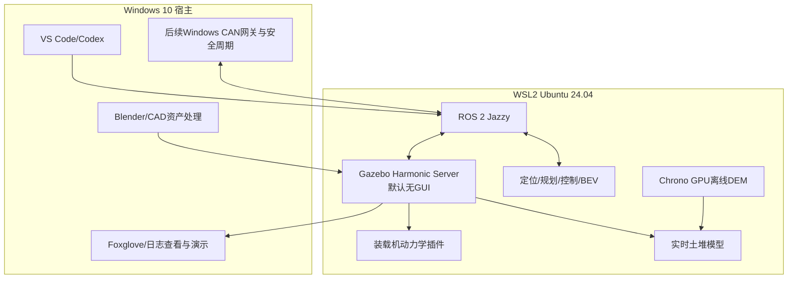

# Windows 10 + WSL2 无人装载机仿真平台方案（v2）

## v2 修订摘要

本版吸收评审中有工程价值的意见，并对其中两点作了修正：

- 将 WSLg / OGRE2 性能测试提前为第 1 周 go/no-go 门槛，并提供 Gazebo Server 无 GUI 运行的后备路径。
- 将刚性地面、障碍物与松散物料拆成不同碰撞层；只禁止铲斗与“松散物料代理网格”的原生接触，保留铲斗与刚性地面、墙体和车辆的真实碰撞。
- 增加铲斗—土堆最小切片原型，先验证受力方向、质量守恒和重复计算问题，再实现完整料堆。
- 将鱼眼 RGB、深度、语义真值和四相机同步作为独立技术预研，并规定锁步触发和统一重投影后备方案。
- 将固定种子的“完全复现”改为多次运行的统计复现。
- 明确斗齿轨迹误差的参考基准、扫掠体积的亚网格积分方法和 `ros2_control` 数据通路。
- 固定 Windows—WSL CAN 网关报文，并明确该路径只提供软实时 HIL；安全周期由 Windows 网关负责。
- 当前 Windows 10 22H2 已结束常规支持；接入公司网络或实车前，必须升级到受支持的 Windows 版本、启用 ESU，或实施物理/网络隔离。

## 总体架构

基于当前设备：

- Windows 10 22H2，Build 19045
- WSL 2.7 已安装
- NVIDIA RTX 2070 8GB
- 暂未安装 Docker、ROS 2
- 允许使用 WSL2
- 不采购商业许可证

采用“Windows 宿主 + WSL2 仿真运行环境”。Gazebo 默认以无 GUI Server 模式运行，WSLg GUI 仅在性能达标时用于调试：

Gazebo、ROS 2、算法和 Chrono 全部运行在 WSL2 内，避免 ROS 2 DDS 跨 Windows/WSL 通信。Windows 只负责开发界面、模型处理、通过 WebSocket 查看结果，以及未来的硬件接口；Windows 侧不运行 ROS 2 节点。

## 第一阶段：搭建 Windows/WSL2 基础环境

### 1. WSL2 配置

- 安装 Ubuntu 24.04 WSL 发行版。
- 在联网开发或 HIL 前处理宿主系统安全状态：优先升级到受支持的 Windows 版本；不能升级时必须启用适用的扩展安全更新，或将主机与办公网、互联网隔离，仅接入受控仿真/HIL 网络。
- WSL 使用 Windows NVIDIA 驱动提供的 GPU 通道；不要在 WSL 内安装 Linux 内核版 NVIDIA 驱动。
- 在 WSL 内验证：
  - `nvidia-smi` 能识别 RTX 2070；
  - WSLg 图形窗口正常；
  - OpenGL/Vulkan 使用 NVIDIA GPU，渲染器不得出现 `llvmpipe`；
  - OGRE2 使用 OpenGL 3.3 以上，目标为 4.3 以上；
  - CUDA 示例可以运行。
- 初期不限制 WSL 内存；确认主机总内存后，再通过 `.wslconfig` 为 Windows 至少保留 8GB 内存。
- 开发源码可以保留在当前 Windows 项目目录，但 `build`、`install`、`log` 和仿真缓存放在 WSL 的 ext4 文件系统中，避免 `/mnt/c` 编译性能下降。

### 2. 安装核心软件

WSL2 内安装并锁定：

- ROS 2 Jazzy
- Gazebo Harmonic
- `ros_gz`
- `ros2_control`
- `robot_state_publisher`
- `xacro`
- `rosbag2`
- RViz2
- CMake、Ninja、colcon、GCC
- Eigen、OpenCV、PCL
- Project Chrono GPU 及 CUDA 依赖
- Python 数据分析与参数拟合环境

Windows 原生安装：

- Blender
- VS Code/Codex 的 WSL 开发支持
- Git
- 可选的 ParaView、Foxglove 或 PlotJuggler 查看工具

Docker Desktop 不作为首版依赖；基础平台稳定后再制作可复现容器。

### 3. 第 1 周 go/no-go 性能门槛

使用同一个最小场景和传感器配置依次测试：

1. WSLg 中运行 Gazebo Server + GUI；
2. 关闭 Gazebo GUI，以 `--headless-rendering` 运行 Server 和 GPU 传感器；
3. 记录渲染器名称、显存峰值、CPU 占用、物理步耗时、传感器丢帧和实时系数。

决策规则固定为：

- GUI 模式实时系数不低于 0.9：允许 GUI 调试，但自动测试仍默认无 GUI。
- GUI 未达标、无 GUI 模式不低于 0.9：项目继续，Gazebo Server 无 GUI 作为标准运行方式；Windows 通过 `foxglove_bridge` 的 WebSocket 或离线日志查看状态，不跨边界运行 DDS。
- 500 Hz 物理在无 GUI 模式仍未达标：Gazebo 主步长降为 4 ms（250 Hz），液压和土壤力模型在插件内部使用 1 ms 子步积分，并降低激光雷达水平采样数。
- 250 Hz 降级配置仍低于 0.9：暂停实时闭环里程碑，不继续堆叠车辆和场景复杂度；该结果构成硬件或宿主系统调整的 go/no-go 结论。

### 4. 固定运行配置

在编写车辆模型前建立三个固定配置：

- `control_realtime`：优先使用物理 500 Hz；若触发已批准的降级方案，则为物理 250 Hz + 插件内部 1 ms 子步。激光雷达 10 Hz、单路调试相机，实时系数不低于 0.9。
- `bev_capture`：4 路 640×480 鱼眼相机、10 Hz 同步输出，允许低于实时运行并录制 rosbag。
- `dem_offline`：关闭 Gazebo 和 BEV 程序，独占 GPU 运行 Chrono DEM。

RTX 2070 上禁止同时运行 Gazebo 多相机、BEV 网络和 Chrono DEM。

## 第二阶段：装载机实时仿真

### 1. 模型结构

装载机拆分为：

- 前后车架；
- 铰接转向机构；
- 四个驱动轮；
- 后桥摆动机构；
- 举升臂、摇臂、连杆和铲斗；
- 举升与翻斗油缸；
- 激光雷达、鱼眼相机、IMU 和编码器安装架。

每个部件分别制作显示网格、低面数碰撞网格和传感器射线网格。所有动作必须通过关节力、轮端扭矩或油缸力产生，正常运行期间不能直接设置车辆和铲斗位姿。

Gazebo Harmonic 不承担完整机械闭环连杆约束求解。举升和翻斗机构采用降阶广义坐标：根据真实连杆几何预计算油缸长度、举升角、翻斗角、斗齿位姿和力臂雅可比；显示连杆跟随广义坐标更新，动力学只在独立自由度上求解。该模型必须与 CAD/解析正解对比后才能进入动力学阶段。

### 2. 动力学实现

在 Gazebo 中开发 C++ 系统插件，主物理步长优先为 2 ms；性能门槛触发时允许使用 4 ms 主步长和 1 ms 内部子步，包含：

- 前后车架质量、质心和惯量；
- 轮端扭矩、制动力和传动比；
- 低速轮胎滑移、滚动阻力和地面摩擦；
- 铰接转向动力学；
- 油缸压力、面积、流量、阀死区、泄压和摩擦；
- 举升/翻斗连杆的几何传动关系；
- 铲斗载荷引起的质量、质心和惯量变化；
- 机械限位、超压、倾翻风险和求解器异常保护。

第一版使用估算参数并标记为 `nominal`；得到厂家和实车数据后才能标记为 `validated`。

## 第三阶段：Windows 硬件条件下的实时散料模型

第一种材料固定为干砂。

实时层采用高度场与解析阻力模型：

- 土堆以 5–10 cm 网格高度场保存。
- 将环境拆成三个明确层次：
  - 刚性基底和障碍物：保留 Gazebo 原生碰撞，铲斗、轮胎和车体均可接触；
  - 松散物料代理网格：供显示和传感器射线使用，不参与铲斗的 Gazebo 原生碰撞；
  - 土壤状态场：由自定义插件保存高度、密度、材料和开挖状态，负责铲斗—散料作用力。
- 使用 collision mask 只屏蔽铲斗/斗齿与松散物料代理网格的原生接触，避免 Gazebo 接触力与解析铲掘力双重计数；不得屏蔽铲斗与刚性地面的碰撞。
- 第一版禁止车轮驶入料堆区域；后续若需要轮土作用，必须增加独立的轮土模型，不能重新启用代理网格碰撞冒充轮土力学。
- 根据铲斗侵入深度、速度、切削角、土壤密度、内摩擦角、黏聚力和斗土摩擦计算铲掘阻力。
- 计算铲斗连续扫掠体积；轨迹与斗刃采用不大于 1 cm 的亚网格积分步长，再将体积守恒地聚合到 5–10 cm 高度场，从土堆中扣除等量材料。
- 进入铲斗的材料转换为有效载荷，实时更新铲斗总质量和质心。
- 铲掘力同时作用于铲斗和土堆，保证作用与反作用一致。
- 卸料采用体素/元胞自动机按休止角重新堆积。
- 土堆显示网格以 5–10 Hz 更新，使激光雷达能够观察到真实缺口和新形成的料堆。
- 少量粒子只表现漏料、扬尘和卸料，不参与主要受力计算。

Chrono GPU 单独建立离线 DEM 模型，回放相同铲斗轨迹，输出铲掘力、装料质量和颗粒流动，用来拟合实时模型参数。

在完整土堆开发前，先制作“单铲斗 + 二维土堆切片”原型，验证 collision mask、侵入检测、受力方向、扫掠体积、材料转移和反力记账。该原型通过后才能扩展到三维料堆。

## 第四阶段：传感器和算法闭环

### 激光定位模式

- 一台 3D 激光雷达，支持扫描线、水平频率、量程、距离噪声、随机丢点和运动畸变。
- 同时输出 IMU、轮速、铰接角和仿真时钟。
- 定位与规划算法全部在 WSL2 中运行。
- 使用 `/clock` 驱动所有算法，禁止混用 Windows 系统时间。

### 鱼眼 BEV 模式

- 四路鱼眼相机固定为 640×480、10 Hz。
- 在车辆资产开发早期安排两周传感器预研，分别验证 WideAngleCamera 的 RGB、深度、语义分割、显存占用和时间戳行为，不把未验证的组合推迟到 BEV 集成阶段。
- RGB 优先使用 Gazebo WideAngleCamera，支持等距投影、曝光、噪声和外参扰动。
- 数据采集采用锁步机制：暂停世界 → 在同一仿真时刻触发四台独立相机 → 等待四帧及真值到齐 → 写入同一帧组 → 推进一步。四路消息必须具有相同仿真时间戳和同一车辆位姿快照。
- 如果 WideAngleCamera 无法输出像素严格对齐的深度或语义真值，则在同一冻结时刻渲染立方体视图，再用统一的鱼眼标定模型重投影 RGB、浮点深度和语义标签；语义使用最近邻采样，RGB 使用双线性采样，深度按目标射线定义转换，禁止用普通 Brown 畸变近似超广角鱼眼。
- 输出语义分割、深度、目标框、可行驶区域真值，以及对应的内外参与重投影映射版本。
- 默认流程是“Gazebo 生成 rosbag → 关闭 Gazebo → 回放 rosbag 运行 BEV”，不要求 RTX 2070 同时实时运行渲染和 BEV 网络。

### 完整作业闭环

状态机固定为：

`定位 → 驶向料堆 → 对正 → 插入 → 收斗 → 举升 → 后退 → 转运 → 对正卸料点 → 卸料 → 返回`

算法只能发送扭矩、制动、铰接转向和液压阀命令，不能直接控制位姿。

## ROS 2 公共接口

控制数据通路固定为：

`定位/规划/VCU适配器 → VehicleCommand → loader_command_controller → ros2_control controller_manager → GazeboSystem硬件接口 → 动力学插件`

状态沿相反方向返回。算法不得绕过 `ros2_control` 直接写 Gazebo 关节；仿真调试器只能通过同一控制接口注入命令。

建立独立的 `loader_sim_msgs`：

- `VehicleCommand`：档位、牵引扭矩、制动、目标铰接角、举升阀开度、翻斗阀开度、急停。
- `VehicleState`：车辆速度、轮速、关节状态、油缸位置/压力、铲斗载荷和故障状态。
- `BucketInteraction`：铲斗六维力、侵入深度、切削面积、进出料流量。
- `TerrainState`：材料类型、剩余体积、已挖体积、已卸体积和质量守恒误差。

标准接口使用：

- `sensor_msgs/PointCloud2`
- `sensor_msgs/Image`
- `sensor_msgs/CameraInfo`
- `sensor_msgs/Imu`
- `sensor_msgs/JointState`
- `/tf` 和 `/clock`

仿真管理提供：

- `/sim/reset`
- `/sim/load_scenario`
- `/sim/pause`
- `/sim/step`
- `/sim/set_seed`

场景使用 YAML 描述地图、车辆起点、料堆参数、卸料目标、传感器配置、随机种子和验收条件。

## 后续 VCU HIL 接入

Windows 10 上的 WSL2 网络不作为实时 CAN 设备接口使用。HIL 阶段采用：

1. Windows 原生 CAN 网关调用设备厂商 SDK；
2. 网关通过固定端口 UDP 将 CAN 帧转发给 WSL2；每个 CAN/CAN-FD 帧对应一个固定头部、可变有效载荷的 UDP 数据报；
3. WSL2 中的 ROS 2 节点完成 CAN 信号与 `VehicleCommand/VehicleState` 映射；
4. UDP 头部固定包含 magic、协议版本、通道号、序号、单调时钟时间戳、CAN ID、标志位、DLC 和 CRC32，多字节字段统一使用网络字节序；
5. Windows 网关负责真实 VCU 的周期调度、超时和安全状态，WSL2/UDP 链路只承担软实时仿真数据交换，不宣称硬实时；
6. Windows 防火墙规则只放行指定程序、固定端口和本机/WSL 子网，不开放到其他网络；
7. 仿真核心不依赖具体 CAN 卡品牌。

如果后续确认 USB-CAN 设备具有稳定的 Linux 驱动，再评估通过 `usbipd-win` 直通 WSL2，但不作为默认方案。

## 验收标准

### 环境验收

- WSL2 内可以访问 RTX 2070 并使用硬件图形加速。
- OGRE2 渲染器不是 `llvmpipe`，并记录驱动、OpenGL 版本和 Gazebo 渲染日志。
- Gazebo 窗口通过 WSLg 正常显示；若 GUI 不满足实时指标，无 GUI Server 模式满足指标也视为通过。
- ROS 2、Gazebo 和算法节点之间通信不经过 Windows DDS。
- 当前 Windows 10 主机在接入办公网、互联网或实车 HIL 前，满足“受支持的 Windows / ESU / 受控隔离网络”三者之一。

### 物理验收

- 斗齿轨迹与基于实测连杆长度、铰点位置和油缸长度得到的解析运动学正解相比，位置 RMSE 不超过 20 mm；同时记录最大误差，不能只报告平均值。
- 材料质量守恒误差不超过 2%。
- 插件内部记录的铲斗作用力与土壤反力记账值之和不超过当前作用力幅值的 1%；该指标不混入刚性基底接触力。
- 所有正常动作均由物理力或扭矩产生。
- 连续执行 100 次完整作业，无穿模、数值爆炸和非预期位姿跳变。

### 统计复现验收

- 固定场景、固定参数和固定随机种子连续运行 10 次，不要求日志逐位一致。
- 单斗装料质量的变异系数不超过 1%。
- 铲掘峰值力的变异系数不超过 2%。
- 最终停车位置最大离散不超过 5 cm，航向最大离散不超过 0.5°。
- 10 次运行均完成状态机，不发生随机失败；若超限，保存每次运行的求解器、接触和传感器时序日志。

### 性能验收

- 控制闭环模式实时系数不低于 0.9。
- 激光雷达和控制链路在线运行。
- 四鱼眼能够同步生成 rosbag，但不要求与 BEV 网络同时实时运行。
- 同一帧组四路鱼眼时间戳完全相同；锁步期间四路相机使用同一个车体位姿快照。
- 重投影模式下 RGB、深度和语义边界对齐误差不超过 0.5 像素。
- Chrono DEM 和 Gazebo 分时使用 GPU。

### 实车标定后的目标

- 行驶与转向响应误差不超过 5%；
- 举升和翻斗动作时间误差不超过 5%；
- 铲掘峰值力和力曲线误差目标不超过 15%；
- 单斗装料质量误差不超过 10%；
- 卸料休止角误差不超过 3°。

## 交付顺序

- 第 1 周：WSL2、GPU、OGRE2、GUI/无 GUI 实时性能 go/no-go。
- 第 2 周：ROS 2、Gazebo、构建目录、日志和固定运行配置。
- 第 3–8 周：装载机运动学模型、基本驾驶；并行完成两周鱼眼/深度/语义预研。
- 第 9–14 周：整车、轮胎和液压动力学；第 9–11 周并行完成铲斗—土堆切片原型。
- 第 15–22 周：实时干砂三维铲装、装料和卸料。
- 第 23–26 周：激光定位与完整作业闭环。
- 第 27–32 周：四鱼眼、BEV 数据录制和自动评测。
- 第 33 周以后：Chrono DEM、实车参数辨识和定量验证。
- VCU HIL 在 SIL 闭环稳定后单独实施。

第一版范围限定为单台四轮铰接装载机、单料堆、单卸料点和干砂。RTX 2070 长期保留，因此不将实时 DEM、高清多鱼眼与 BEV 同时运行、复杂扬尘流体或照片级渲染列入验收范围。

## 主要技术风险与门槛

| 风险 | 触发条件 | 固定处理方式 |
|---|---|---|
| WSLg/OGRE2 性能不足 | GUI 模式 RTF < 0.9 | 默认使用无 GUI Server；仍不足则启用 250 Hz + 内部子步降级 |
| GPU 退到软件渲染 | 渲染器出现 `llvmpipe` | 停止性能测试，先修复 WSL GPU/驱动链路 |
| 土壤阻力双重计数 | 松散物料代理网格产生原生接触力 | 修正 collision mask，刚性基底碰撞保持开启 |
| 闭环连杆不稳定 | 原生闭链出现约束漂移或发散 | 使用经过解析正解验证的降阶广义坐标和雅可比 |
| 鱼眼真值不对齐 | WideAngleCamera 缺少对应真值或像素错位 | 冻结时刻渲染立方体视图并统一重投影 |
| 四相机不同步 | 时间戳或车体位姿不一致 | 使用暂停、统一触发、收齐、再步进的锁步采集 |
| 仿真不可逐位复现 | 固定种子日志仍有数值差异 | 使用 10 次运行的统计容差验收 |
| Windows 10 安全风险 | 接入公司网络、互联网或实车 | 升级受支持系统、启用 ESU 或网络隔离 |
| UDP/WSL 不满足硬实时 | 出现调度抖动或丢包 | Windows 网关承担周期与安全；WSL 链路只标记为软实时 |

## 官方兼容性依据

- [ROS 2 Jazzy 与 Gazebo Harmonic 支持关系](https://gazebosim.org/docs/harmonic/comparison/)
- [Gazebo Harmonic 渲染与 OGRE2 故障排查](https://gazebosim.org/docs/harmonic/troubleshooting/)
- [Windows 10 结束支持说明](https://learn.microsoft.com/en-us/lifecycle/announcements/windows-10-end-of-support)
